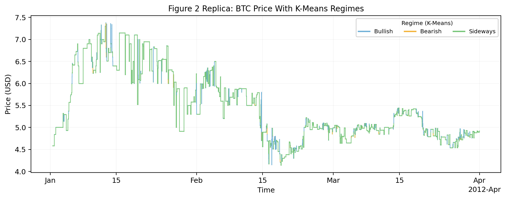
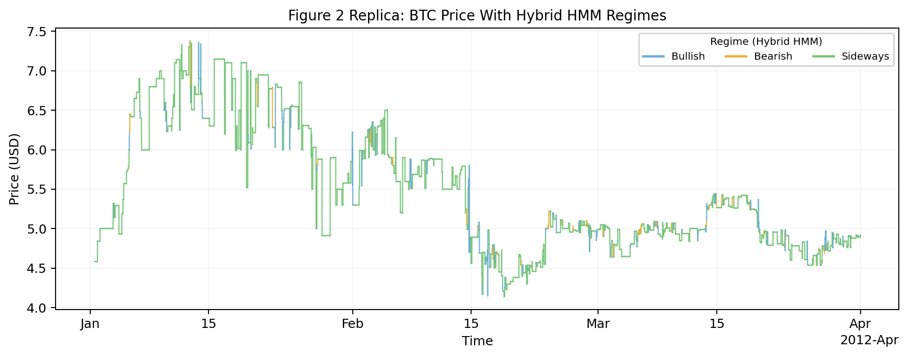

# BTC Regime Reproduction Repo

Research-first reproduction scaffold for the Bitcoin regime article using a K-Means initialized HMM pipeline.

Current default dataset:

- external input path: `${BTC_BINANCE_SOURCE_PATH}`
- market approximation: `Binance BTCUSDT futures`
- fidelity caveat: this is not the exact `BTC/USD 1m 2012-2021` dataset referenced by the article

## Environment Setup

This repo reads local paths from `.env` automatically when you run the CLI.

Copy `.env.example` to `.env` and set the paths for your machine:

```bash
cp .env.example .env
```

Required variables:

- `BTC_REGIME_OUTPUT_ROOT`
- `BTC_BINANCE_SOURCE_PATH`
- `BTC_PAPER_SOURCE_PATH`
- `BTC_PAPER_LIKE_SOURCE_PATH`

## What this repo does

- Validates and resamples raw 1-minute BTC OHLCV into a canonical 5-minute dataset
- Builds `log_return` and `rolling_volatility` features
- Runs elbow diagnostics for `K=2..6`
- Compares:
  - `hmm_random_init`
  - `kmeans_initialized_hmm`
- Exports artifacts per run under `runs/`

## CLI

```bash
python scripts/prepare_btc_data.py --config configs/local_btc_binance_2021_2026.yaml
python scripts/run_regime_reproduction.py --config configs/local_btc_binance_2021_2026.yaml
python scripts/compare_models.py --run-dir runs/<run_id>
```

## Repo layout

- `src/btc_regime_repro/`: reusable pipeline code
- `configs/`: example configs
- `scripts/`: CLI entrypoints
- `tests/`: unit tests
- `runs/`: timestamped artifacts

## Latest experiment

Latest paper-alignment run:

- run id: `repro_20260506_040324`
- config: `configs/paper_like_btcusd_2012_2021.yaml`
- paper table similarity:
  - Table 1: `53.64%`
  - Table 2: `24.85%`
  - Table 3: `59.39%`
  - Combined Table 1-3 score: `45.96%`

Key outputs from this run:

- Table 1 summary:
  - close mean `7880.96`
  - log return std `0.00347`
  - volatility mean `0.00200`
  - volume mean `29.08`
- Table 2 centroids:
  - bullish `return 0.00288`, `volatility 0.00418`
  - sideways `return -0.00003`, `volatility 0.00131`
  - bearish `return -0.00628`, `volatility 0.00419`
- Table 3 transition matrix:
  - bullish -> bullish `0.6123`
  - bearish -> bearish `0.8041`
  - sideways -> sideways `0.8804`

Plots from the latest run:

### KMeans-only



### Hybrid HMM + K-Means



Notes:

- This run uses the paper-like `BTCUSD` approximation dataset, not the exact `btcusd_1-min_data.csv` referenced by the article.
- The latest tuning pass uses separate feature tail clipping for `log_return` and `rolling_volatility` to improve paper-table alignment without changing the core K-Means -> HMM workflow.
